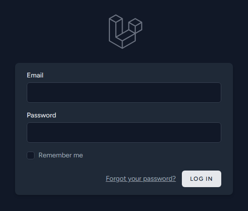
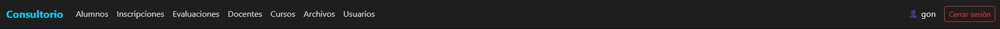
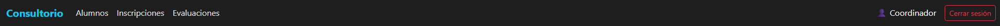
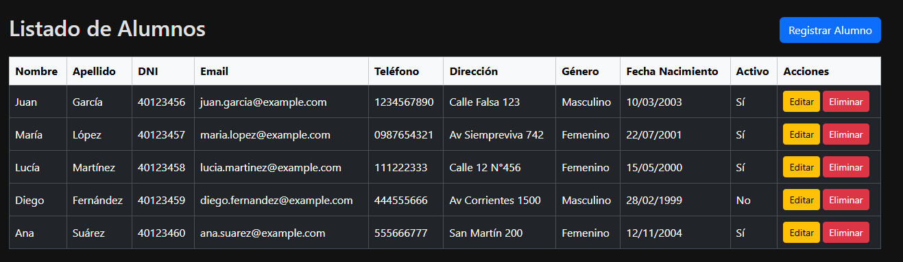
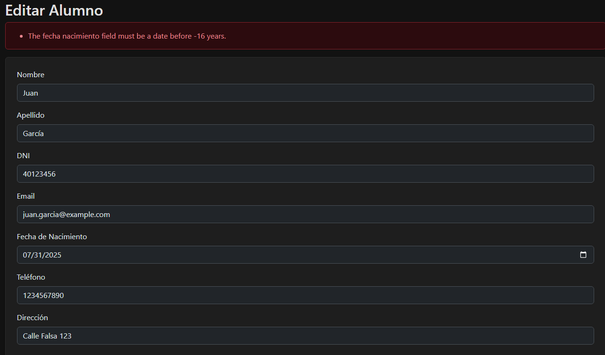
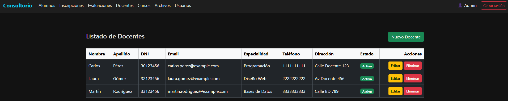
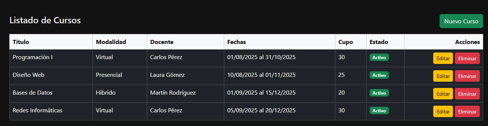
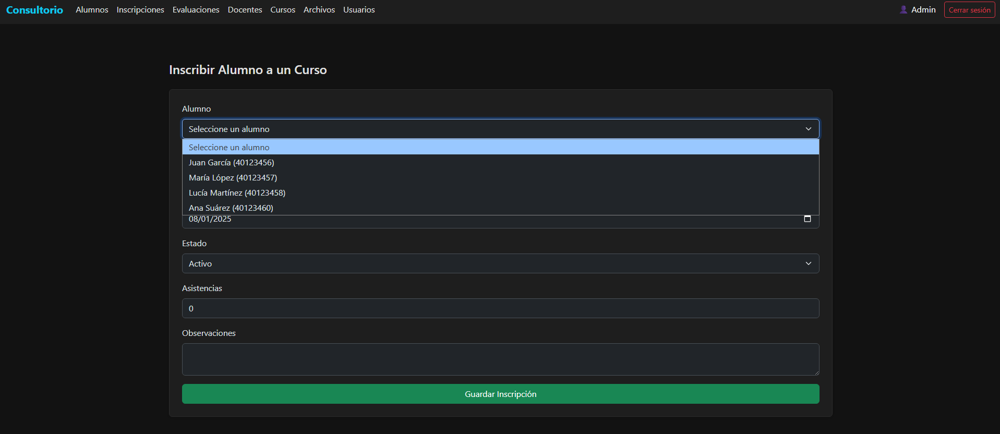
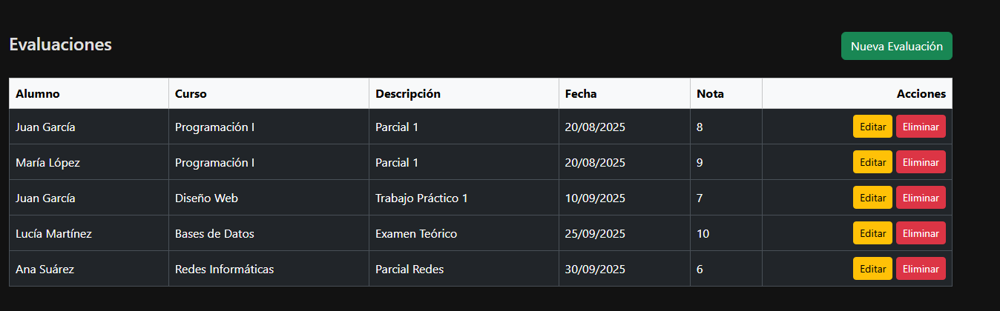
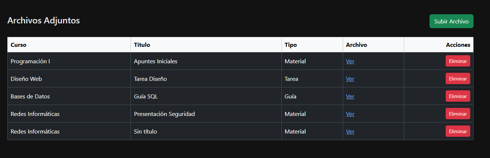

El Sistema de Gestión de Cursos es una aplicación web desarrollada en Laravel, cuyo objetivo es brindar una plataforma para la administración de alumnos, docentes, cursos, inscripciones, evaluaciones y archivos adjuntos en un entorno académico.

La solución implementa el patrón MVC (Modelo-Vista-Controlador) y usa el ORM Eloquent para garantizar un acceso estructurado, seguro y eficiente a la base de datos.

El sistema está diseñado con un enfoque multirol, diferenciando claramente las funcionalidades de los usuarios administradores y coordinadores:

Administradores:
- Pueden crear, editar, listar y eliminar docentes y cursos.
- Gestionan usuarios del sistema.
- Tienen permisos exclusivos para cargar y administrar archivos adjuntos relacionados con los cursos.

Coordinadores:
- Pueden registrar y administrar alumnos.
- Se encargan de la carga de inscripciones.
- Tienen acceso a la gestión de evaluaciones de alumnos en los cursos correspondientes.

El sistema cumple con una serie de validaciones críticas para mantener la integridad y consistencia de los datos, tales como:
- Los alumnos deben ser mayores de 16 años y no pueden inscribirse si se encuentran inactivos.
- Un alumno no puede estar inscrito en más de 5 cursos activos de forma simultánea.
- Los docentes inactivos no pueden recibir nuevos cursos, y cada uno puede manejar como máximo 3 cursos activos.
- Las fechas de los cursos se validan para garantizar coherencia (fecha de fin posterior a la de inicio), además de controlar cupos y estado.
- Las notas de evaluaciones deben encontrarse entre 1 y 10, y la aprobación depende del porcentaje mínimo de asistencia.
- Los archivos adjuntos solo pueden subirse en formatos permitidos (PDF, DOCX, PPT, JPG, PNG).

A nivel técnico, el sistema utiliza migraciones, relaciones entre modelos mediante Eloquent, validaciones del lado del servidor, y vistas Blade con layouts reutilizables.
El frontend está integrado con Bootstrap y gestionado mediante Vite, mientras que la autenticación y el manejo de sesiones aprovechan los mecanismos provistos por Laravel.

- Login

- Dashboard cuando sos admin

- Dashboard cunado sos coordinador

- Listado de alumnos con las opciones para hacer el crud

- Validacion de edad al crear/editar alumno

- Listado de docentes solo para admins

- Listado de cursos

- Solo se puede inscribir a alumnos activos por ej a Diego Fernandez no.

- Listado de evaluaciones

- Listado de archivos adjuntos